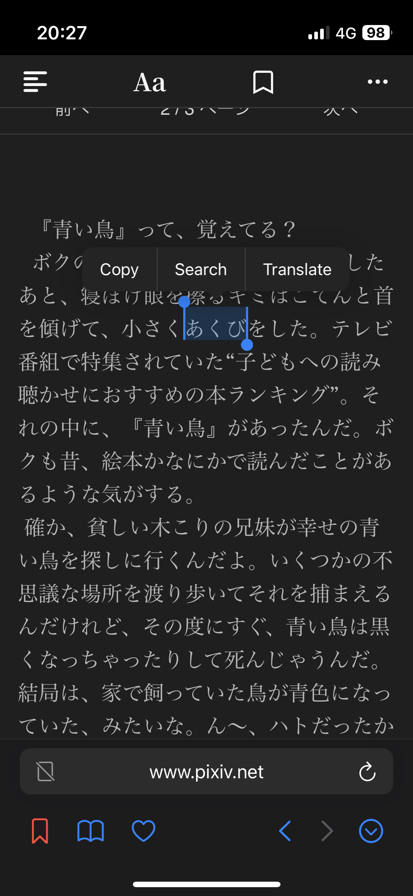
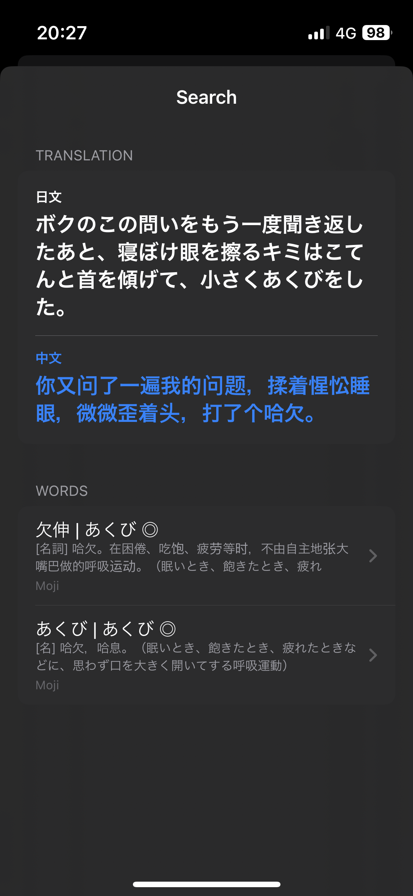
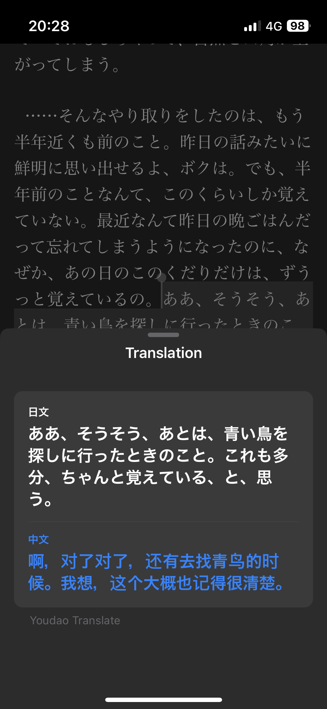

开发的初衷是在安卓上有类似的软件，但是iOS上却没有，于是自己写了一个。  
以及，还有iOS自带的翻译过于不准确，和词典缺少不常见的词（尤其是流行语）的原因。  
至少自己用起来是很好用的！  

## 功能
- 搜索单词
- 翻译句子
- 一键添加到Anki note

## 安装

大概过两天可能会上 TestFlight ？如果想要自己安装并且有相关知识，可以到 GitHub 的 [Release](https://github.com/Chen03/StaticeApp/releases) 里下载最新的 ipa。

## 使用

### 词典模式

打开 App 就是词典模式。使用的是 Moji 辞书。  

### 网页模式

点击最下的浏览网页就可以打开内置的浏览器。  
可以点击地址栏输入网址。左下角的红色flag可以把当前页面添加到收藏，书本图标可以打开收藏。  

选中任意文本时，会弹出 Search 和 Translate，点击 Search 会搜索当前单词，并且翻译上下文句子，方便理解。点击 Translate 会翻译当前句子。翻译使用的是有道翻译。

右下角可以收起地址栏，拓宽空间。  

## 后续

会针对某些小说网站增加阅读模式，目前的计划只有 Pixiv。