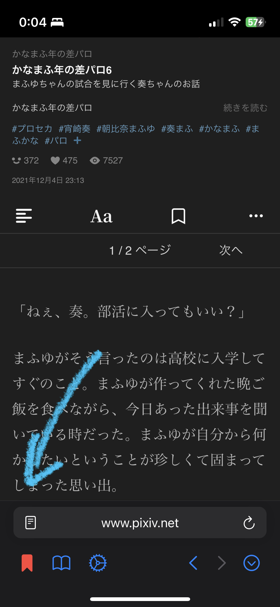
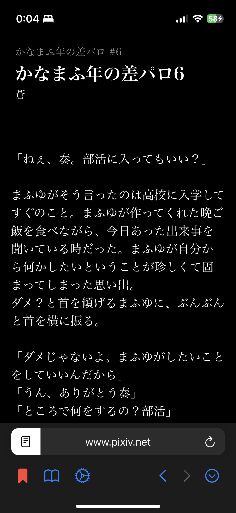
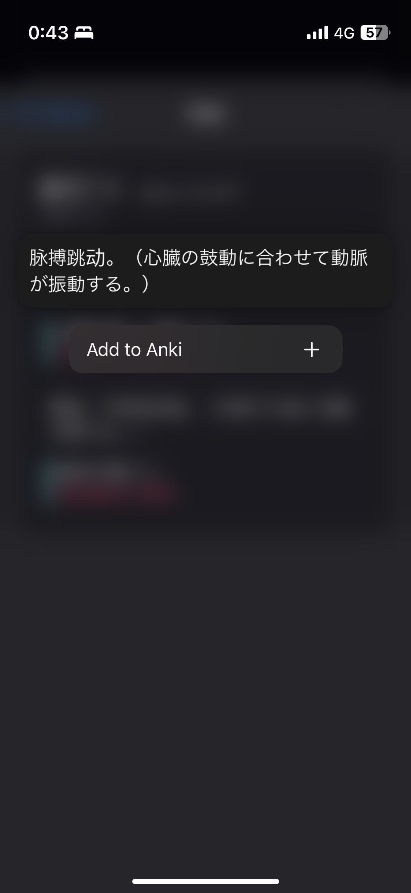
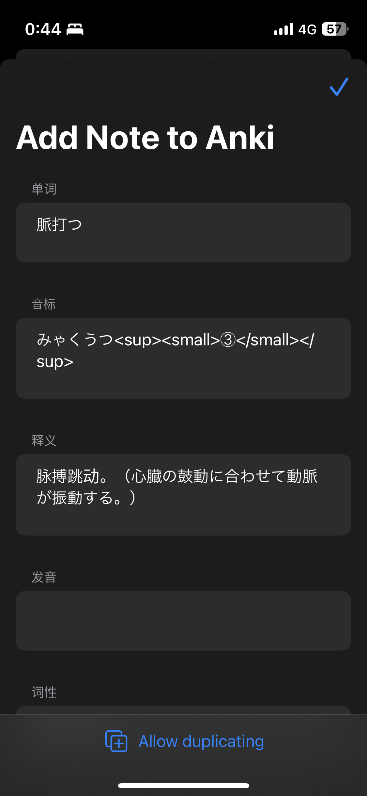
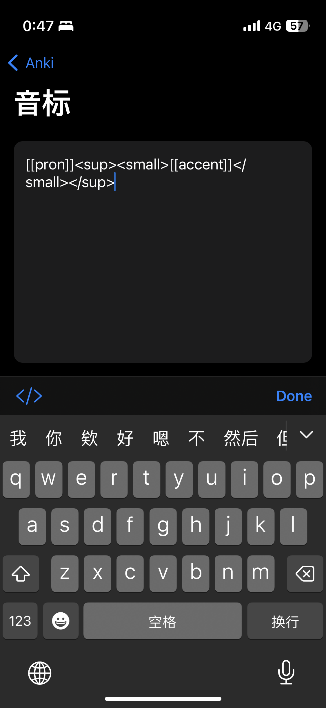

开发的初衷是在安卓上有类似的软件，但是iOS上却没有，于是自己写了一个。  
以及，还有iOS自带的翻译过于不准确，和词典缺少不常见的词（尤其是流行语）的原因。  
至少自己用起来是很好用的！  

## 功能

- 搜索单词
- 翻译句子
- 一键添加到Anki note

## 安装

本应用要求 iOS16 及以上的系统。

### Testflight

如果你不懂得 Sideload 或者使用 Altstore，请参加应用的 Testflight 来安装应用。  

[参加 Testflight](https://testflight.apple.com/join/rOd5PlDt)

如果你之前没有安装过 Testflight App，请参照页面内的指引安装 Testflight。

### IPA

请到 [Release](https://github.com/Chen03/StaticeApp/releases) 里下载最新的 ipa。

## 使用

### 网页浏览

点击地址栏输入网址以浏览网页。  
左下角的红色flag可以把当前页面添加到收藏，书本图标可以打开收藏。  

### 查询单词与翻译文本

选中任意文本时，会弹出 Search 和 Translate，点击 Search 会搜索当前单词，并且翻译上下文句子，方便理解。点击 Translate 会翻译当前句子。翻译使用的是有道翻译。

右下角可以收起地址栏，拓宽空间。 

### 阅读模式

有时候网页的广告特别烦人，所以做了阅读模式。  
只要点击地址栏左侧的按钮就可以打开阅读模式。  

目前只适配了 Pixiv，后续大概会推出对 AO3 和 poipiku 的支持。

### 添加到 Anki

在词语详情页面，长按任意释义或例句，即可把生词添加到 Anki。在添加前，可以对每一个 field 进行调整。  

注意：在使用这一功能前，要先点击齿轮获取 Anki 的信息，并设定单词信息和字段的关系。在编辑界面点击</>标记，可以插入单词信息。下面是刚才的例子的设置：  

程序会把用双中括号括起的内容自动替换成对应的词条内容，填入上一步的 fields 中。  
注意：如果 Anki 中的卡片、牌组等信息更新了，要在本应用的设置中再次同步，否则可能出现问题。

## 后续

大概会继续完善 bug 和修复细节，毕竟已经成了自己晚上睡觉前看同人必不可少的工具了……  
如果真的有除了自己的人用就好了……  
嗯没有也挺好的。  